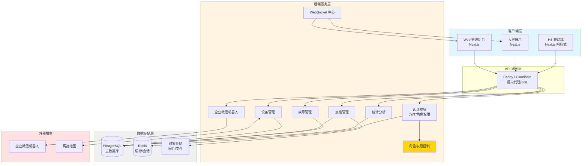
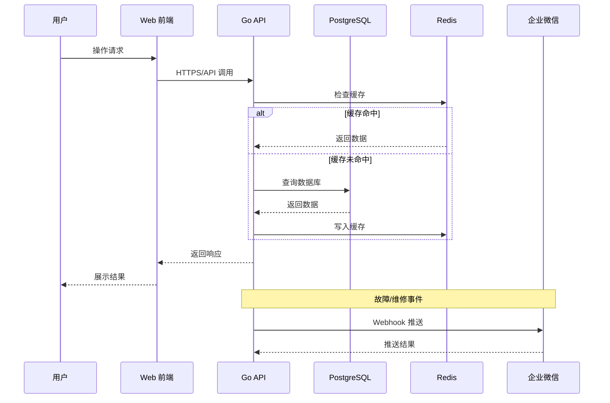
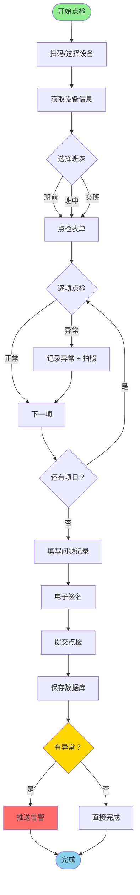
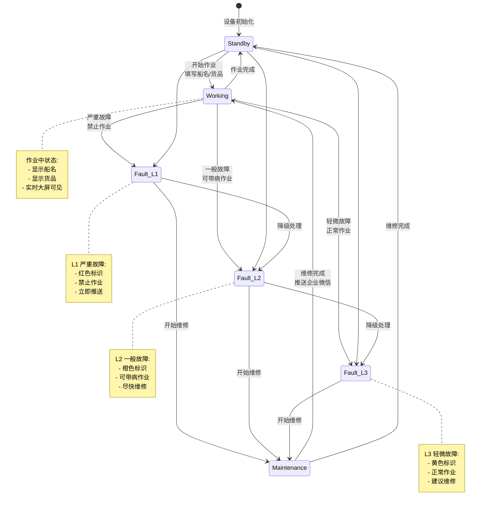
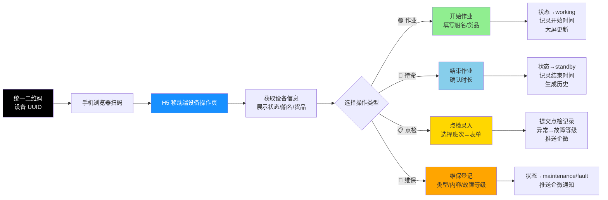
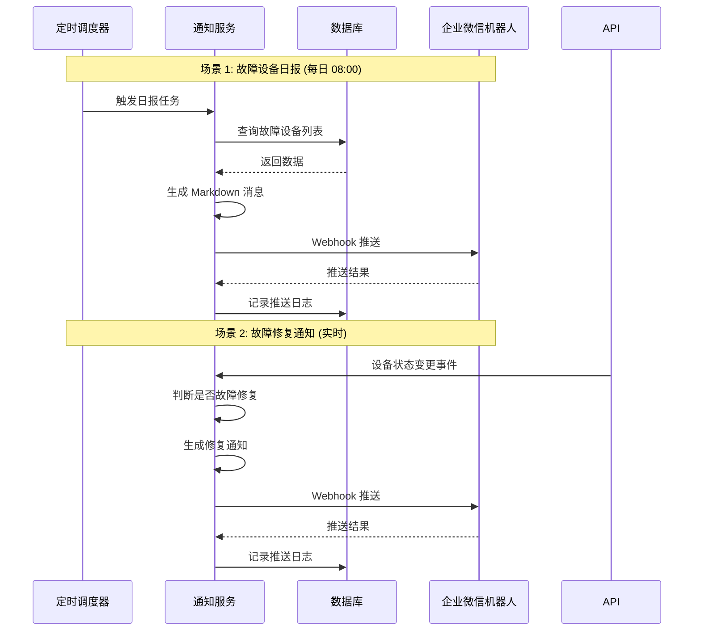
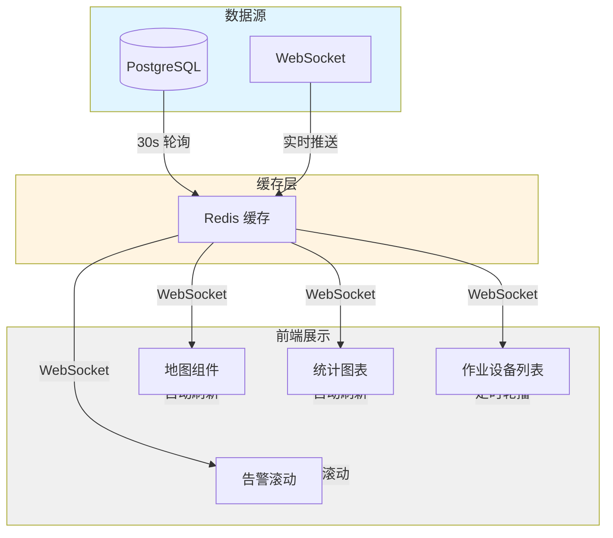
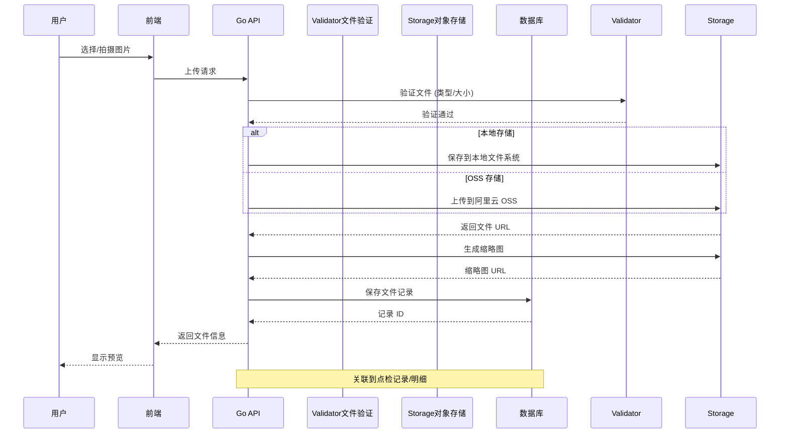
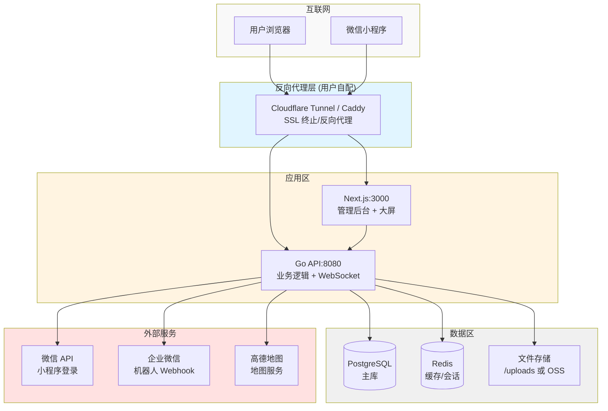

# 系统架构图

> 版本：v1.2
> 更新日期：2026-03-09
> 变更：添加角色权限管理

## 0. 角色权限架构

### 0.1 角色定义

系统定义 3 种角色，每种角色有不同的权限范围：

| 角色 | 标识 | 说明 | 典型用户 |
|------|------|------|----------|
| **管理员** | `admin` | 拥有系统全部权限 | 设备管理员、系统管理员 |
| **维保员** | `maintainer` | 负责设备维保、点检 | 维修工、保养人员 |
| **操作司机** | `operator` | 负责设备作业、点检 | 起重机司机、操作手 |

### 0.2 权限矩阵

```
┌────────────────┬──────────┬────────────┬──────────────┐
│ 操作类型       │ 管理员   │ 维保员     │ 操作司机     │
├────────────────┼──────────┼────────────┼──────────────┤
│ 作业           │ ✅       │ ❌         │ ✅           │
│ 待命           │ ✅       │ ✅         │ ✅           │
│ 点检           │ ✅       │ ✅         │ ✅           │
│ 维保           │ ✅       │ ✅         │ ❌           │
│ 故障登记       │ ✅       │ ✅         │ ✅           │
│ 用户管理       │ ✅       │ ❌         │ ❌           │
│ 设备管理       │ ✅       │ ❌         │ ❌           │
│ 点检标准       │ ✅       │ ❌         │ ❌           │
└────────────────┴──────────┴────────────┴──────────────┘

核心规则:
- 操作司机：可以点检但不能维保
- 维保员：可以点检但不能作业
- 管理员：拥有全部权限
```

## 1. 整体系统架构



> **变更说明**: 移除微信小程序 API 依赖，H5 移动端通过标准 HTTPS/API 与后端通信。

## 2. 数据流架构



## 3. 点检业务流程



## 4. 设备状态流转



## 5. 统一二维码设计 (4 个操作选项)



**说明**:
- 每台设备一个统一二维码，包含设备 UUID
- 扫码后进入 H5 移动端设备操作页，展示设备当前状态
- 4 个操作选项：作业 (开始作业)、待命 (结束作业)、点检 (点检录入)、维保 (维保登记)
- 故障报告不是独立选项，而是在点检异常或维保登记时选择故障等级
- **技术变更**: 使用 H5 移动端替代微信小程序，通过 html5-qrcode 库实现扫码

## 6. 企业微信推送流程



## 7. 大屏数据更新机制



## 8. 文件上传流程



## 9. 认证授权架构

```mermaid
flowchart TD
    subgraph WebAuth["Web 认证流程"]
        User1[用户] --> Login1[登录页面]
        Login1 --> Credentials1[用户名/密码]
        Credentials1 --> API1[Go API 验证]
        API1 --> JWT1[生成 JWT Token]
        JWT1 --> Storage1[存入 Redis]
        JWT1 --> Return1[返回前端]
        Return1 --> Header1[存入 localStorage]
        Header1 --> Request1[后续请求携带]
        Request1 --> Middleware1[JWT 中间件验证]
        Middleware1 --> Access1[访问资源]
    end

    subgraph MiniAppAuth["小程序认证流程"]
        User2[用户] --> Launch2[打开小程序]
        Launch2 --> Login2[微信登录]
        Login2 --> Code2[获取 Code]
        Code2 --> API2[Go API]
        API2 --> WeChatAPI[微信 code2session]
        WeChatAPI --> Session2[获取 OpenID]
        Session2 --> JWT2[生成 JWT Token]
        JWT2 --> Return2[返回小程序]
        Return2 --> Storage2[存入 Storage]
        Storage2 --> Request2[后续请求携带]
        Request2 --> Middleware2[JWT 中间件验证]
        Middleware2 --> Access2[访问资源]
    end

    style WebAuth fill:#e1f5ff
    style MiniAppAuth fill:#fff4e1
```



## 10. 部署架构 (Cloudflare / Caddy)



**说明**:
- 反向代理和 SSL 终止由用户自行配置 (Cloudflare Tunnel 或 Caddy)
- 文档中提供配置参考示例
- 默认不部署 Nginx

---

**说明**: 以上架构图使用 Mermaid 语法编写，可在支持 Mermaid 的 Markdown 编辑器中渲染查看，如：
- GitHub/GitLab (部分支持)
- VS Code + Mermaid 插件
- Mermaid Live Editor (https://mermaid.live)
- Notion
- Obsidian
